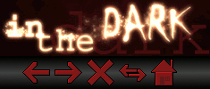

# In The Dark (Bloodmoon Edition)

A dark, simple, red-tinted theme for Pale Moon.

#### Supports
 * Pale Moon [34.0 - 34.*]

## Building
Simply download the contents of the "src" folder  and pack the contents into a .zip file. Then, rename the file to .xpi and drag into the browser.

## Download
You can grab the latest release from the [Official Web Site](//realityripple.com/Software/Themes/In-The-Dark/Pale-Moon/Bloodmoon-Edition).
